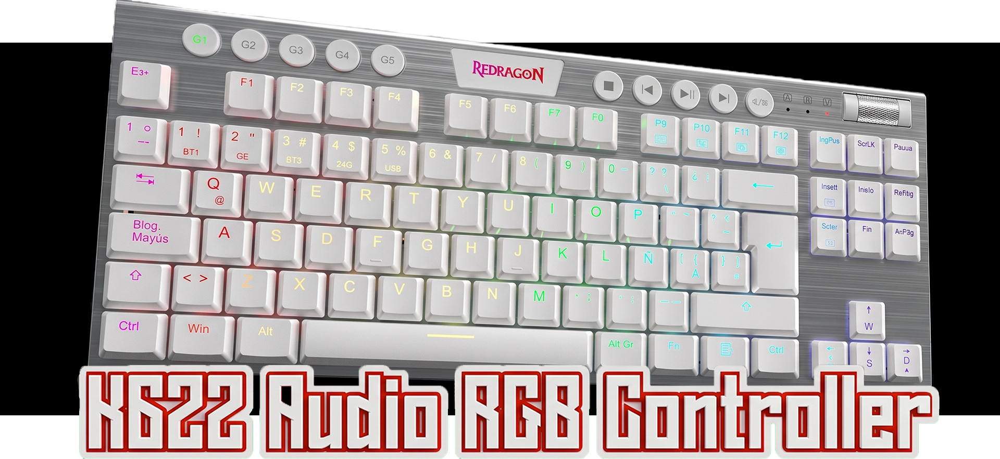
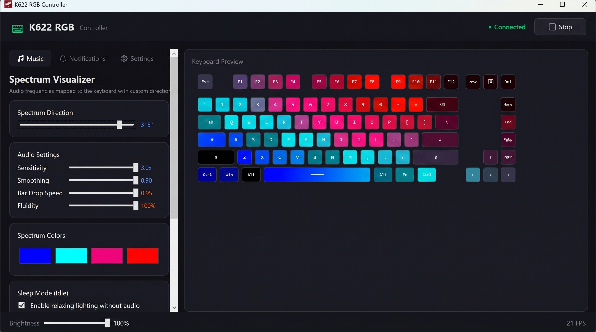
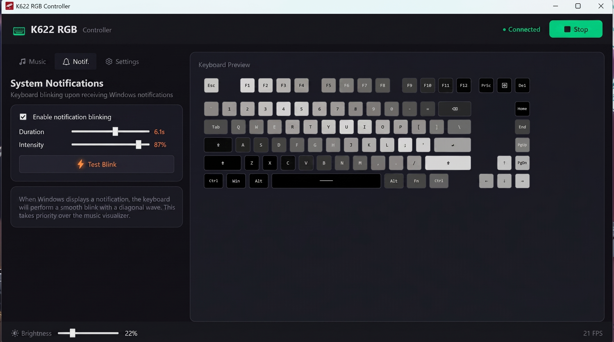
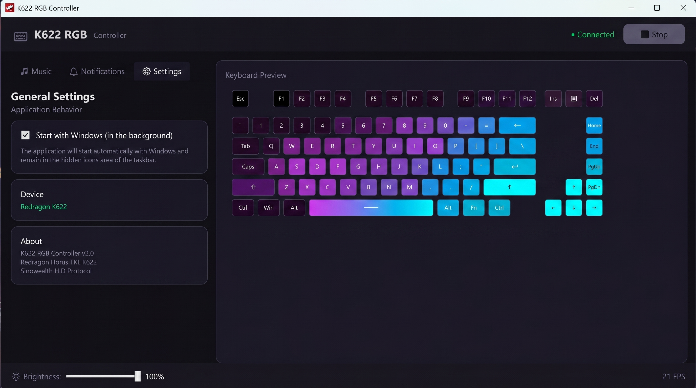

# Redragon Horus K622 RGB Controller



A high-performance, real-time RGB lighting controller for the **Redragon Horus TKL K622** keyboard. This application migrates the original Python-based controller to a modern **C# .NET 8.0 WPF** architecture, providing a smoother experience, lower CPU usage, and professional UI.

[](https://opensource.org/licenses/MIT)
[](https://dotnet.microsoft.com/download/dotnet/8.0)
[](https://www.microsoft.com/windows)

---

## 📸 Preview

<div align="center">
  
  
  <br />
  
</div>

---

## ✨ Key Features

- 🎵 **Real-time Audio Visualization:** Synchronize your keyboard lighting with system audio (music, games, videos) using high-precision FFT analysis.
- 🔔 **Notification Alerts:** Flash specific colors or patterns when you receive Windows notifications.
- ⌨️ **Virtual Keyboard Preview:** Real-time visual representation of your keyboard's current RGB state within the app.
- 🎨 **Custom Static Modes:** Create and save your own color profiles and static lighting layouts.
- 🚀 **Performance Optimized:** Built with C# and .NET 8.0 for near-zero latency and minimal resource impact.
- 📥 **System Tray Support:** Run in the background with easy access from the system tray.

---

## 🛠️ Built With

The project leverages several powerful libraries to interact with hardware and process audio:

- **[C# / WPF](https://learn.microsoft.com/en-us/dotnet/desktop/wpf/)** - Modern UI framework.
- **[NAudio](https://github.com/naudio/NAudio)** - Audio processing and system sound capture.
- **[FftSharp](https://github.com/swharden/FftSharp)** - Fast Fourier Transform for audio frequency analysis.
- **[HidLibrary](https://github.com/mikeobrien/HidLibrary)** - Communication with USB HID devices.
- **[CommunityToolkit.Mvvm](https://github.com/CommunityToolkit/dotnet)** - Professional MVVM pattern implementation.
- **[Hardcodet.NotifyIcon.Wpf](https://github.com/hardcodet/wpf-notifyicon)** - System tray and notification management.

---

## ⚙️ Requirements

- **Operating System:** Windows 10/11 (x64)
- **Keyboard:** Redragon Horus TKL K622 (Sinowealth-based controller)
- **Runtime:** [.NET 8.0 Desktop Runtime](https://dotnet.microsoft.com/en-us/download/dotnet/8.0)

---

## 🚀 Installation & Build

### Option 1: Build from source
1. Clone the repository:
   ```bash
   git clone https://github.com/jioryII/Redragon-k622-audio-rgb-controller.git
   ```
2. Open `K622RGBController.sln` (or the folder) in **Visual Studio 2022** or **VS Code**.
3. Restore NuGet packages.
4. Build and Run in `Release` mode.

### Option 2: Run pre-built binary
Check the [Releases](https://github.com/jioryII/Redragon-k622-audio-rgb-controller/releases) page for the latest standalone executable.

---

## 🤝 Acknowledgments

This project is a modernized migration and extension. Special thanks to the community efforts in reverse-engineering the Sinowealth HID protocol for Redragon keyboards.

- Original HID protocol research inspired by community projects for Redragon K618/K622.

---

## 📄 License

This project is licensed under the MIT License - see the [LICENSE](LICENSE) file for details.

---

<p align="center">Made with ❤️ for the Redragon community</p>
